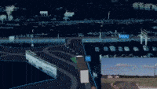
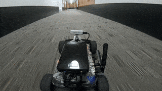
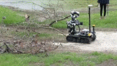
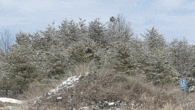
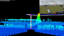
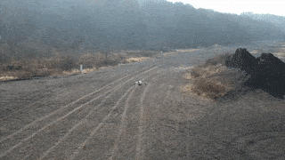
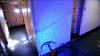
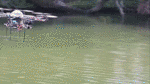
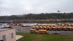

<table>
  <tr>
        <td style="text-align: right;">
            
  

        </td>
        <td style="padding-left:2%; width:75%"><strong>HAL</strong>, <i> 2022-Present</i> 
            

            

                 <b>H</b>ome <b>A</b>pprentice <b>L</b>earner (HAL) aims to help humans automate daily tasks around the house. Since HAL is an apprentice, it can learn a new task, such as clean up after dinner, only from a few human demonstrations.
            

        </td>
  <tr>
  <tr>
        <td style="text-align: right;">
            
  

        </td>
        <td style="padding-left:2%; width:75%"><strong>Self-driving</strong>, <i> 2019-Present</i> 
            

            

                Working with an amazing team at <a href="https://aurora.tech/" target="_blank"> Aurora </a> to develop and deliver self-driving, safely, broadly and quickly.   
            

        </td>
    <tr>
    <tr>
        <td style="text-align: right;">
            
  

        </td>
        <td style="padding-left:2%; width:75%"> <strong> MuSHR </strong>, <i> 2018-2019</i> 
            

                Led a team of students to design a fleet of low-cost autonomous RC cars. The hardware and software is completely <a href="https://mushr.io/" target="_blank"> open-sourced </a>, 
                and intended for education and research. 
            

        </td>
    <tr>
    <tr>
        <td style="text-align: right;">
            
  

        </td>
        <td style="padding-left:2%; width:75%"><strong>RoMan</strong>, <i>2018-2019</i>  
            

                Developing the motion planning stack for a mobile manipulation platform RoMan for ARL RCTA project. 
                The robot can navigate over difficult terrain, lift weights of up to 25 kg, and clear a pile of debris autonomously. 
            

        </td>
    <tr>
    <tr>
        <td style="text-align: right;">  
            
  

        </td>
        <td style="padding-left:2%; width:75%"><strong>Full-scale Helicopter</strong>, <i>2012 - 2017</i>  
            

                Developed the motion planning software pipeline for a full-scale autonomous helicopter for ONR
                AACUS project. The platform flies at 60m/s and can sense up to 1200m. The software was evaluated
                on multiple platforms: Boeing’s Unmanned Little Bird and Bell 206 Jetranger.
            

        </td>
    <tr>
    <tr>
        <td style="text-align: right;"> 
            
  

        </td>
        <td style="padding-left:2%; width:75%"><strong>Long Term Autonomy UAV</strong>, <i>2017</i>  
            

                Developed the planning software for a hexarotor (DJI-M600) platform that executes missions for over 2 hours in an obstacle course flying at speeds of upto 15 m/s. 
            

        </td>
    <tr>
    <tr>
        <td style="text-align: right;">  
            
  

        </td>
        <td style="padding-left:2%; width:75%"><strong>Terrain Exploring UAV</strong>, <i>2017</i>  
            

                Developed a quadcopter (DJI-M100) that navigates over diverse terrains avoiding obstacles like hills, trees, electric wires at 
                high speeds of upto 5 m/s. 
            

        </td>
    <tr>
    <tr>
        <td style="text-align: right;">  
            
  

        </td>
        <td style="padding-left:2%; width:75%"><strong>Shipdeck Exploring UAV</strong>, <i>2015</i>  
            

                Developed a quadcopter for autonomously exploring the inside of an unmapped ship relying on only a floor plan. 
            

        </td>
    <tr>
    <tr>
        <td style="text-align: right;">  
            
 
            

        </td>
        <td style="padding-left:2%; width:75%"><strong>River Exploring UAV</strong>, <i>2012-2013</i>  
            

                Developed an octocopter that autonomously explores and maps out river banks, avoiding obstacles at speeds of upto 3 m/s

        </td>
    <tr>
    <tr>
        <td style="text-align: right;">  
            
 
            

        </td>
        <td style="padding-left:2%; width:75%"><strong>Helicopter Sensor Head</strong>, <i>2012</i>  
            

                Developed sensor suite mounted on a full-scale helicopter for actively tracking a landing site on a shipdeck. 

        </td>
    <tr>
