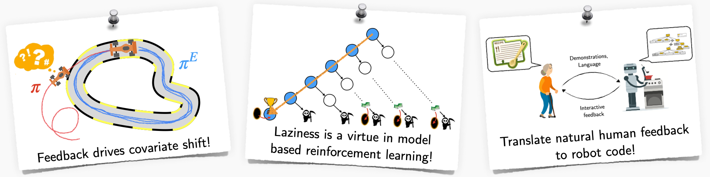
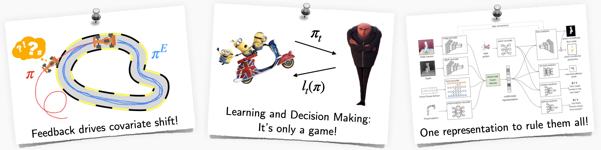
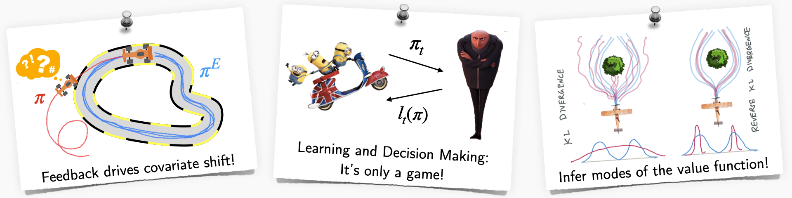

MACRL is used by a number of courses in Cornell, UW and CMU. Some of the recent ones are below:

## CS 6756: Learning for Robot Decision Making (Fall 2023)
[https://www.cs.cornell.edu/courses/cs6756/2023fa/](https://www.cs.cornell.edu/courses/cs6756/2023fa/) 

Machine learning has made significant advances in many AI applications from language (e.g. ChatGPT) to vision (e.g. Diffusion models). However, it has fallen short when it comes to making decisions, especially for robots interacting within the physical world. Robot decision making presents a unique set of challenges - complexities of the real world, limited labelled data, hard physics constraints, safety aspects when interacting with humans, and more. This graduate-level course dives deep into these issues, beginning with the basics and traversing through the frontiers of robot learning. We look at:
1. **Planning** in continuous state-action spaces over long-horizons with hard physical constraints. 
2. **Imitation learning** from various modes of interaction (demonstrations, interventions) as a unified, game-theoretic framework.
3. **Practical reinforcement learning** that leverages both model predictive control and model-free methods.
4. **Frontiers** such as offline reinforcement learning, LLMs, diffusion policies and causal confounds.

 

## CS 4756: Robot Learning (Spring 2023)
[https://www.cs.cornell.edu/courses/cs4756/2023sp/](https://www.cs.cornell.edu/courses/cs4756/2023sp/)

Advances in machine learning have proved critical for robots that continually interact with humans and their environments. Robots must solve the problem of both perception and decision making, i.e., sense the world using different modalities and act in the world by reasoning over decisions and their consequences. Learning plays a key role in how we model both sensing and acting. This course covers various modern robot learning concepts and how to apply them to solve real-world problems. We look at:
1. **Learning perception models** using probabilistic inference and 2D/3D deep learning.
2. **Imitation and interactive no-regret learning** that handle distribution shifts, exploration/exploitation.
3. **Practical reinforcement learning** leveraging both model predictive control and model-free methods.
4. **Open challenges** in visuomotor skill learning, forecasting and offline reinforcement learning.

 

## CS 6756: Learning for Robot Decision Making (Fall 2022)
[https://www.cs.cornell.edu/courses/cs6756/2022fa/](https://www.cs.cornell.edu/courses/cs6756/2022fa/) 

Advances in machine learning have fueled progress towards deploying real-world robots from assembly lines to self-driving. Learning to make better decisions for robots presents a unique set of challenges. Robots must be safe, learn online from interactions with the environment, and predict the intent of their human partners. This graduate-level course dives deep into the various paradigms for robot learning and decision making. We look at:
1. **Interactive no-regret learning** as a fundamental framework for handling distribution shifts, hedging, exploration/exploitation.
2. **Imitation learning** from various modes of interaction (demonstrations, interventions) as a unified, game-theoretic framework.
3. **Practical reinforcement learning** that leverages both model predictive control and model-free methods.
4. **Open challenges** in safety, causal confounds and offline learning.

This course focuses on algorithms, lessons from real world robotics and features a strong programming component.

 

